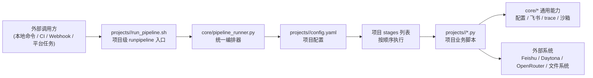

# RunPipeline 架构与扩展指南

这份文档只回答一件事：

这个仓库如何把“一个项目 = 一个完整编排入口（runpipeline）”做成可复用框架，并让后续新项目尽量只写业务逻辑，不改核心编排。

---

## 1. 先给结论

这个仓库现在已经具备了比较清晰的分层：

1. `core/` 是通用内核，负责“怎么跑”。
2. `projects/<project_name>/` 是项目插件层，负责“跑什么”。
3. `projects/<project_name>/run_pipeline.sh` 是项目对外入口。
4. `core/pipeline_runner.py` 是项目入口背后的统一编排引擎。

换句话说：

- 如果你要新增一个项目，不应该先去改 `core/`。
- 你应该先在 `projects/<新项目>/` 下放 `config.yaml`、阶段脚本、可选的 prompt/schema。
- 最后暴露一个 `run_pipeline.sh`，把这个项目目录交给 `core.pipeline_runner` 去执行。

这正是“一个 runpipeline 就是某个项目完整编排入口”的实现方式。

---

## 2. 全局架构图



---

## 3. 你可以怎么理解“runpipeline”

当前仓库里，真正的“通用运行入口”有两层：

### 第 1 层：项目入口

每个项目自己的入口脚本：

- `projects/expert_review/run_pipeline.sh`

它的职责很薄：

- 接收外部传入的 `RECORD_ID`
- 设置 `PYTHONPATH`
- 检查依赖
- 调用 `python3 -m core.pipeline_runner --project-dir <当前项目目录> --record-id <id>`

所以以后如果你新增 `projects/code_review/`、`projects/design_review/`，最自然的方式就是每个项目各自提供一个同结构的 `run_pipeline.sh`。

### 第 2 层：统一编排入口

`core/pipeline_runner.py` 是真正的编排引擎，它不关心项目业务，只做四件事：

1. 读取项目目录下的 `config.yaml`
2. 找到 `stages`
3. 按顺序执行每个 stage 脚本
4. 根据 `exit_code_handling` 决定继续、停止还是报错

所以：

- `run_pipeline.sh` 是“项目对外入口”
- `core.pipeline_runner` 是“项目内部统一编排器”

---

## 4. 实际执行流程图

下面这张图就是当前 `expert_review` 项目的真实运行链路。

```mermaid
flowchart TD
    start["开始\n传入 RECORD_ID"] --> entry["projects/expert_review/run_pipeline.sh"]
    entry --> runner["core.pipeline_runner.run_pipeline(project_dir, record_id)"]
    runner --> load["load_project_config(project_dir)"]
    load --> stage1["Stage 1: pre_screen.py"]
    stage1 --> ps1["读取飞书主表记录"]
    ps1 --> ps2["下载 Trace 附件"]
    ps2 --> ps3["trace_parser + trace_extractor"]
    ps3 --> ps4["执行 7 项硬门槛检查"]
    ps4 --> ps5{"退出码"}
    ps5 -->|1| stop["stop\n流水线正常结束"]
    ps5 -->|0 或 2| stage2["Stage 2: ai_review.py"]
    stage2 --> ai1["再次读取主表记录"]
    ai1 --> ai2["组装 AI 输入文本"]
    ai2 --> ai3["读取 prompt.md + schema.json"]
    ai3 --> ai4["Daytona 沙箱执行 Claude"]
    ai4 --> ai5["生成 ai_review_result.json"]
    ai5 --> stage3["Stage 3: writeback.py"]
    stage3 --> wb1["读取 pre_screen_result.json"]
    wb1 --> wb2["读取 ai_review_result.json"]
    wb2 --> wb3["按 config 中 scoring 计算总分"]
    wb3 --> wb4["生成结论 + 机审说明"]
    wb4 --> end["回填飞书主表"]
```

---

## 5. 目录职责

### `core/`：框架内核层

这个目录应该只放跨项目复用的能力。

当前主要职责如下：

| 文件 | 职责 |
|------|------|
| `core/pipeline_runner.py` | 统一编排 stages |
| `core/config_loader.py` | 读取项目配置，合并环境变量，提供字段映射查询 |
| `core/feishu_utils.py` | 飞书认证、读写记录、下载附件 |
| `core/trace_parser.py` | 解析 trace 基础统计 |
| `core/trace_extractor.py` | 从 trace 中提取“用户聚焦内容” |
| `core/daytona_runner.py` | 沙箱创建、文件上传、Claude 执行、结果下载、JSON 修复 |

这一层最大的价值是：

- 项目脚本不需要重复写飞书访问逻辑
- 项目脚本不需要重复写 trace 解析逻辑
- 项目脚本不需要重复写 Daytona/Claude 调用逻辑
- 项目脚本只需要组合这些能力

### `projects/`：项目插件层

每个子目录都代表一个具体业务项目。

当前只有：

- `projects/expert_review/`

它内部包含：

| 文件 | 角色 |
|------|------|
| `config.yaml` | 项目定义文件 |
| `pre_screen.py` | 第一阶段 |
| `ai_review.py` | 第二阶段 |
| `writeback.py` | 第三阶段 |
| `prompt.md` | AI 评审提示词 |
| `schema.json` | AI 评审输出约束 |
| `run_pipeline.sh` | 项目对外入口 |

### `scripts/`：辅助脚本层

这个目录目前更像历史脚本/运维脚本/实验脚本，不是新的标准扩展路径。

它们有几个特征：

- 有些直接写死表 ID 或字段名
- 有些直接复用旧接口签名
- 有些绕过了当前项目级 `run_pipeline.sh -> core.pipeline_runner` 这条主链路

所以如果你要继续扩展“多个 runpipeline 项目”，建议把 `scripts/` 当作辅助工具，而不是主架构模板。

---

## 6. `config.yaml` 为什么是扩展核心

这个仓库真正的扩展支点，不是某个 Python 类，而是项目级 `config.yaml`。

`config.yaml` 至少承担了 5 类职责：

### 6.1 定义项目身份

```yaml
project:
  name: expert_review
  description: "专家考核产物自动审核"
```

### 6.2 定义流水线阶段

```yaml
stages:
  - name: pre_screen
    script: pre_screen.py
    exit_code_handling:
      0: continue
      1: stop
      2: continue
```

这意味着：

- 编排顺序是配置驱动的
- 阶段数量是可变的
- 每个项目可以有自己的 exit code 语义

### 6.3 定义外部字段映射

```yaml
field_mapping:
  task_description: "任务说明"
  trace_file: "Trace 文件"
  review_status: "审核状态"
```

这意味着：

- 业务脚本可以使用稳定的逻辑名
- 真正的飞书字段名可以按项目变化
- 新项目不需要把中文字段名写死在 `core/`

### 6.4 定义评分与阈值

`writeback.py` 并没有把维度完全写死在通用层，而是通过 `scoring.dimensions` 去提取分数。

这意味着：

- 不同项目可以有不同评分模块
- 不同项目可以有不同维度数量
- 不同项目可以调整阈值

### 6.5 定义工作目录产物位置

```yaml
workspace:
  trace_path: "/workspace/trace.jsonl"
  pre_screen_result_path: "/workspace/pre_screen_result.json"
  ai_review_result_path: "/workspace/ai_review_result.json"
```

这意味着：

- 各阶段之间通过稳定文件契约交接数据
- 项目可以修改中间文件路径，而不是写死在脚本里

---

## 7. `expert_review` 项目是如何消费框架的

把当前项目拆开看，会更容易理解以后怎么复用。

### Stage 1：`pre_screen.py`

它做的是“业务前置过滤”，而不是通用编排。

输入：

- `record_id`
- `project_dir`
- 主表记录
- trace 附件

复用的通用能力：

- `load_project_config`
- `get_field_name`
- `FeishuClient`
- `parse_trace_file`
- `extract_user_focused_content`

项目自己的业务逻辑：

- 7 项硬门槛规则
- 粗筛状态判定
- 粗筛结果落盘
- 粗筛阶段回填策略

### Stage 2：`ai_review.py`

它做的是“把这个项目的业务材料组装成模型输入，再调用通用沙箱执行器”。

复用的通用能力：

- 配置加载
- 飞书读取
- trace 精简
- `run_claude_in_sandbox`

项目自己的业务逻辑：

- 如何拼接 prompt 输入
- 使用哪份 `prompt.md`
- 使用哪份 `schema.json`
- 结果失败时如何兜底

### Stage 3：`writeback.py`

它做的是“把项目自己的评分规则变成最终结论，并写回外部系统”。

复用的通用能力：

- 配置加载
- 飞书写回

项目自己的业务逻辑：

- 如何抽取分数
- 结论规则是什么
- 机审说明怎么组织

---

## 8. 新项目如何快速新增一个 runpipeline

以后如果要新增一个项目，推荐固定用下面这套模板。

```text
projects/
  new_project/
    config.yaml
    run_pipeline.sh
    stage_a.py
    stage_b.py
    stage_c.py
    prompt.md          # 可选
    schema.json        # 可选
```

### 第一步：写 `config.yaml`

至少包含：

- `project`
- `feishu`
- `stages`
- `field_mapping`
- `workspace`

如果有 AI 评审，再补：

- `ai_review`
- `scoring`

### 第二步：每个 stage 遵守统一 CLI 契约

每个脚本都实现：

```bash
python3 xxx.py --record-id <id> --project-dir <dir>
```

这是因为 `core.pipeline_runner` 固定按这个参数形式调用。

### 第三步：用退出码表达业务分支

例如：

- `0` 表示成功，进入下一阶段
- `1` 表示失败或终止
- `2` 表示待人工复核但继续

然后把退出码解释写进：

```yaml
exit_code_handling:
  0: continue
  1: stop
  2: continue
```

### 第四步：项目入口只做薄封装

`run_pipeline.sh` 最好只做：

1. 参数检查
2. 环境准备
3. 依赖兜底安装
4. 调用 `core.pipeline_runner`

不要把复杂业务逻辑写进 shell。

---

## 9. 什么该放 `core/`，什么该留在项目目录

这是后续扩展时最关键的边界。

### 应该放进 `core/` 的内容

- 跨项目都会复用的外部系统接入
- 通用数据读取/清洗/解析逻辑
- 通用执行器
- 与具体项目字段名无关的工具函数

典型例子：

- 飞书客户端
- trace 解析器
- 沙箱执行器
- 配置加载器
- 通用 pipeline runner

### 应该留在 `projects/<name>/` 的内容

- 某个项目特有的字段语义
- 某个项目特有的评分维度
- 某个项目特有的输入拼装方式
- 某个项目特有的回填规则
- 某个项目特有的 prompt/schema

典型例子：

- “专家能力分/Trace 资产分”这种业务定义
- “7 项硬门槛”这种规则集合
- “最终审核通过/初审中/已拒绝”这种状态映射

---

## 10. 当前架构的优点

### 优点 1：编排和业务已经分离

`pipeline_runner` 不知道什么是“专家审核”，它只知道“stage 列表 + 退出码策略”。

这就是可扩展性的基础。

### 优点 2：项目目录天然就是插件目录

只要遵守约定：

- 有 `config.yaml`
- 有 stage 脚本
- 有项目入口 shell

这个项目就能挂到同一个框架里跑。

### 优点 3：外部系统适配已经公共化

飞书、trace、Daytona 这些最烦的基础能力已经提到 `core/`，后续新增项目不需要重写。

### 优点 4：测试明确在保护“可扩展性”

`tests/test_extensibility.py` 已经在验证：

- 新项目可拥有不同字段映射
- 新项目可拥有不同阶段数
- 新项目可拥有不同评分维度
- 新项目不需要修改 `core/` 就能跑起来

这说明作者的目标和你现在想做的方向是一致的。

---

## 11. 当前需要特别注意的地方

如果后续要让更多人快速上手，这几件事最好明确告诉团队。

### 注意 1：旧教程已经和当前代码有漂移

`docs/tutorial_phase1_setup.md` 还是旧版本叙事，和当前代码不完全一致，例如：

- 旧文档里是 6 项硬检查，现在代码里是 7 项
- 旧文档里强调单模块 0-10 分，现在代码是双模块评分
- 旧文档里入口名是 `run_expert_review_pipeline.sh`，当前代码里是 `projects/expert_review/run_pipeline.sh`

所以新人不要把旧教程当作当前架构真相。

### 注意 2：`scripts/` 更像历史脚本，不是标准扩展模板

例如有些脚本还在使用旧函数签名或旧表结构，这说明它们更适合作为辅助工具，不适合拿来复制成新项目模板。

### 注意 3：有些测试已经暴露出“接口漂移”

本地执行 `python3 -m unittest tests.test_extensibility tests.test_pipeline_and_e2e` 时，发现两类问题：

1. 运行环境缺 `daytona_sdk/daytona`
2. 少数测试仍在调用旧函数签名

这不影响当前主架构判断，但说明仓库还存在一部分“代码已演进，测试/辅助脚本未同步”的技术债。

### 注意 4：AI 评审模块对 Daytona 依赖是顶层导入

这会带来一个实际影响：

- 即使只是想 import `ai_review.py` 里的纯函数，也会先要求环境能 import `daytona_runner`

如果后续想进一步优化可测试性，可以把 Daytona 相关 import 下沉到真正执行沙箱的路径里。

---

## 12. 推荐的团队认知模型

给新人讲这个仓库时，我建议只强调下面这句话：

> `core/` 决定“流水线怎么跑”，`projects/<name>/` 决定“这个项目具体跑什么”，`projects/<name>/run_pipeline.sh` 就是这个项目的完整编排入口。

再展开成 3 个动作就够了：

1. 看 `projects/<name>/config.yaml`，理解这个项目有哪些阶段。
2. 看每个 stage 脚本，理解这个项目每一步在做什么业务。
3. 看 `core/`，理解这些业务脚本调用了哪些公共能力。

只要按这个顺序读，新人会很快建立正确心智模型。

---

## 13. 最后给一个“新增项目”最小模板

```bash
projects/new_project/
```

`config.yaml`

```yaml
project:
  name: new_project
  description: "新项目说明"

feishu:
  app_id: ""
  app_secret: ""
  app_token: ""
  table_id: ""

stages:
  - name: collect
    script: collect.py
    exit_code_handling:
      0: continue
      1: error
  - name: analyze
    script: analyze.py
    exit_code_handling:
      0: continue
      1: continue
  - name: writeback
    script: writeback.py
    exit_code_handling:
      0: continue

field_mapping:
  input: "输入"
  output: "输出"
  status: "状态"

workspace:
  intermediate_path: "/workspace/intermediate.json"
  result_path: "/workspace/result.json"
```

`run_pipeline.sh`

```bash
#!/bin/bash
set -euo pipefail

RECORD_ID="${RECORD_ID:-}"
[ -z "$RECORD_ID" ] && { echo "错误: RECORD_ID 未设置" >&2; exit 1; }

SCRIPT_DIR="$(cd "$(dirname "$0")" && pwd)"
REPO_ROOT="$(cd "$SCRIPT_DIR/../.." && pwd)"
export PYTHONPATH="$REPO_ROOT:${PYTHONPATH:-}"

python3 -m core.pipeline_runner --project-dir "$SCRIPT_DIR" --record-id "$RECORD_ID"
```

只要先把这个最小骨架建立起来，再往 stage 里补业务逻辑，就已经是符合当前仓库设计方向的扩展方式了。
